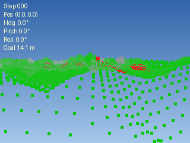

# DTAP-MPPI

DTAP-MPPI (Dynamic Terrain-Aware Payload MPPI) is an augmented control algorithm based on the Model-Predictive Path Integral (MPPI) framework. The augmentations optimize MPPI for payload-transportation robots operating in environments with dynamic obstacles and uneven terrain. The controller samples thousands of candidate trajectories in parallel on the GPU, evaluates their costs, and computes a weighted optimal control update — all in real time.

This repository uses [Numba-CUDA](https://numba.readthedocs.io/en/stable/cuda/index.html) for GPU-accelerated trajectory rollouts in a pure Python environment.

---

## Demo

| Bird's-Eye View | Robot POV |
|:---:|:---:|
|  |  |
| Terrain elevation overlay, sampled rollouts (orange), weighted-mean trajectory (green), dynamic obstacles (red), and subgoal (green star). | Simulated stereo-camera view with traversability coloring: green = safe, yellow = caution, red = avoid. |

---

## Features

- **GPU-parallelized rollouts** via Numba-CUDA — thousands of trajectories sampled per control step
- **Dynamic obstacle avoidance** with probabilistic obstacle modeling
- **Online terrain estimation** using a stereo-camera-based Digital Elevation Map (DEM)
- **Traversability classification** via an online Gaussian Naive Bayes classifier bootstrapped from the heightmap
- **Hierarchical planning** — a local waypoint selector feeds intermediate subgoals to MPPI, enabling long-horizon navigation
- **Multiple dynamics models** — differential drive, Ackermann steering, and bicycle model

---

## Repository Structure

```
DTAP-MPPI/
├── controllers/
│   ├── cuda_kernels.py          # GPU kernels: rollouts, cost, weight update
│   ├── mppi_baseline.py         # MPPI for static environments
│   ├── mppi_dynObs.py           # MPPI with dynamic obstacle + terrain awareness
│   ├── mppi_terraneous.py       # MPPI variant for rough terrain
│   └── waypointSelector.py      # Local subgoal planner
├── dynamics/
│   ├── models.py                # Model registry (differential drive, Ackermann, bicycle)
│   ├── cuda_dynamics.py         # GPU dynamics implementations
│   └── native_dynamics.py       # CPU dynamics implementations
├── environments/
│   ├── staticEnv.py             # Static circular/rectangular/polygon obstacles
│   ├── dynamicEnv.py            # Moving obstacles with avoidant/static modes
│   └── terraneousEnv.py         # Terrain + dynamic obstacles combined
├── terrain_estimators/
│   ├── camera.py                # Stereo camera model + point cloud generation
│   ├── DEM_builder.py           # Incremental DEM fusion from point clouds
│   ├── traversability_BCM.py    # Online Gaussian Naive Bayes traversability classifier
│   └── estimator_kernels.py     # GPU kernels for terrain estimation
├── src/
│   ├── staticMPPI_test.py       # Static obstacle scenario
│   ├── dynMPPI_test.py          # Dynamic obstacle scenario
│   └── dynProbMPPI_test.py      # Full pipeline: terrain + dynamic obstacles + traversability
└── media/
    ├── GIFs/BirdsEyeView/       # Bird's-eye view animations
    ├── GIFs/POV/                # Robot POV animations
    └── Visualizations/          # Static result plots
```

---

## Dependencies

- Python 3.13
- An NVIDIA GPU supported by Numba-CUDA
- [CUDA Toolkit](https://developer.nvidia.com/cuda-downloads) (matching your driver version)
- [uv](https://docs.astral.sh/uv/getting-started/installation/) — Python package manager

Python package dependencies (managed by uv):

| Package | Purpose |
|---|---|
| `numba` | GPU kernel compilation via CUDA + NJIT Compilation |
| `numpy` | Array math |
| `matplotlib` | Visualization and GIF export |
| `pillow` | Image rendering for POV GIFs |
| `scipy` | Terrain upsampling |

---

## Installation

**1. Install uv**

```bash
curl -LsSf https://astral.sh/uv/install.sh | sh
```

**2. Clone the repository**

```bash
git clone https://github.com/akhilghar/DTAP-MPPI
cd DTAP-MPPI
```

**3. Create the virtual environment and install dependencies**

```bash
uv sync
```

This reads `pyproject.toml` and installs all dependencies into `.venv/` automatically.

**4. Verify your GPU is accessible**

```bash
uv run python numba_test.py
```

A successful run prints your CUDA device name. If this fails, check that your CUDA Toolkit version matches the installed Numba version.

---

## Running the Simulations

All scripts should be run from the repo root.

**Static obstacles only:**
```bash
uv run python src/staticMPPI_test.py
```

**Dynamic obstacles:**
```bash
uv run python src/dynMPPI_test.py
```

**Full pipeline** (dynamic obstacles + terrain estimation + traversability classification):
```bash
uv run python src/dynProbMPPI_test.py
```

Each script runs the simulation, saves a bird's-eye-view GIF to `media/GIFs/BirdsEyeView/`, a robot POV GIF to `media/GIFs/POV/`, and static result plots to `media/Visualizations/`.

---

## Key Parameters

The `MPPIConfig` dataclass controls the planner. The most impactful ones:

| Parameter | Description |
|---|---|
| `num_samples` | Number of parallel trajectory rollouts (higher = better coverage, more GPU memory) |
| `horizon` | Lookahead steps |
| `dt` | Timestep (s) |
| `lambda_` | Temperature — lower values make the controller greedier toward low-cost samples |
| `Q`, `Qf`, `R` | State tracking, terminal, and control cost weights |
| `Q_obs` | Obstacle penalty weight |
| `noise_sigma` | Per-dimension control perturbation magnitude |

## Some Notes on the Dynamics Models

The Dynamics Registry in `models.py` features differential drive, bicycle, and Ackermann kinematic models for the robot. Currently, the differential drive is the only model featuring terraneous and superflat compatibility. These updates are to be reflected in the bicycle and Ackermann models. Some important notes about these models are tabulated below:

| Model | States | Control Inputs | Parameters |
|---|---|---|---|
| `differential_drive` | horizontal pos `x (m)`, vertical pos `y (m)`, heading `θ (rad)`, pitch `ψ (rad)`, roll `φ (rad)` | left wheel velocity `v_l (m/s)`, right wheel velocity `v_r (m/s)` | wheelbase `L (m)`, drag coefficient `κ` |
| `differential_drive_noslope` | horizontal pos `x (m)`, vertical pos `y (m)`, heading `θ (rad)` | left wheel velocity `v_l (m/s)`, right wheel velocity `v_r (m/s)` | wheelbase `L (m)` |
| `bicycle` | horizontal pos `x (m)`, vertical pos `y (m)`, heading `θ (rad)`, speed `v (m/s)` | acceleration `a (m/s^2)`, steering angle `γ (rad)` | wheelbase `L (m)` |
| `ackermann` | horizontal pos `x (m)`, vertical pos `y (m)`, heading `θ (rad)`, speed `v (m/s)` | acceleration `a (m/s^2)`, steering angle `γ (rad)` | wheelbase `L (m)` |
